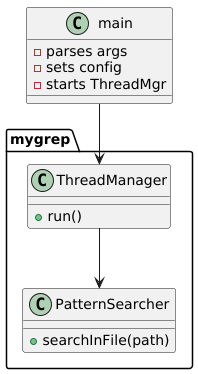
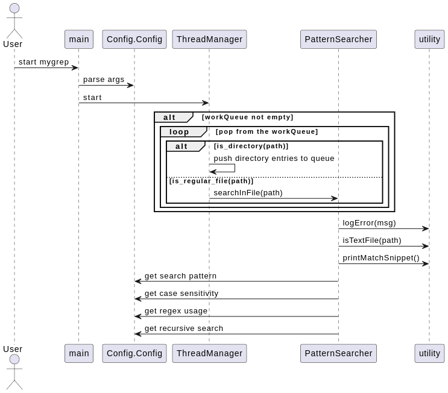

# mygrep

A C++ command-line tool for searching patterns in files, similar to `grep`. Supports plain text and regex search, case sensitivity, and handles large files efficiently.

## Features

- Search for plain text or regular expressions in files
- Case-sensitive and case-insensitive search
- Handles large files efficiently
- Graceful handling of binary files and empty patterns
- Unicode support

## Design Idea
- The design of `mygrep` is modular, focusing on separation of concerns.
- The idea is keep reading the contents of the directories recursively and add them to a thread safe queue.
- Worker threads then consume this queue and search for the pattern in the files and push the directory 
paths from the directory back to the queue.
- The number of worker threads is configurable, allowing for parallel processing of files. Current thread 
cap is set to 1 core less than the max number of cores to ensure the smooth running of the OS and system processes. 
- This is kept simple to avoid complexity in thread management.
- The main components include:
    - **Config**: Holds configuration settings like search pattern, case sensitivity, regex usage, and recursive search.
    - **PatternSearcher**: Responsible for searching patterns in files.
    - **ThreadManager**: Manages worker threads that perform the search operations.
    - **Utility functions**: Provide common functionalities like logging errors, checking file types, and printing match snippets.

## Alternative Design
- An alternative design could involve two Queues: one for directories and another for files.
- Thread manager would then manage two sets of worker threads: 
  - Producer threads which read the directory entries from directory queue and populate the Directories and Files Queue.
  - Consumer threads which read the files  from the Files Queue and search for the pattern.
- Thread manager is dynamic in nature and starts with 75% of the thread cap for producer threads and 25% for consumer threads.
when the Files Queue grows, the number of producer threads will reduce and consumer threads will increase to consume the files.
When the producer threads are done, it will start consuming the files from the Files Queue. And if the Files Queue is empty 
and there are still directories to be explored, the % of producer threads go up reducing the number of consumer thread.
- The analogy here is similar to a producer-consumer model where initially goods are produced and stockpiled to be consumed which requires more producers.
And based on the stock, consumption is increased or decreased.
- This design would allow for more flexibility in handling directories and files separately, but it would also introduce 
additional complexity in managing two queues and ensuring thread safety across them. Therefore, the current design is preferred for its simplicity and effectiveness.

## Low level design

```sh
@startuml
namespace mygrep {
    class PatternSearcher {
      +searchInFile(path)
    }

    class ThreadManager {
      +run()
    }
}

class main {
  - parses args
  - sets config
  - starts ThreadMgr
}


main --> ThreadManager
ThreadManager --> PatternSearcher

@enduml

```


## Sequence Diagram

```sh
@startuml
actor User
User -> main : start mygrep
main -> Config.Config : parse args
main -> ThreadManager : start
alt workQueue not empty
    loop pop from the workQueue
        alt is_directory(path)
            ThreadManager -> ThreadManager : push directory entries to queue
        else is_regular_file(path)
            ThreadManager -> PatternSearcher : searchInFile(path)
        end
    end
end
PatternSearcher -> utility : logError(msg)
PatternSearcher -> utility : isTextFile(path)
PatternSearcher -> utility : printMatchSnippet()
PatternSearcher -> Config.Config : get search pattern
PatternSearcher -> Config.Config : get case sensitivity
PatternSearcher -> Config.Config : get regex usage
PatternSearcher -> Config.Config : get recursive search
@enduml
```



## Building

Requires CMake and a C++20-compatible compiler.

```sh
mkdir build
cd build
cmake <source directory>
```
To build with tests:

```sh
cmake -DBUILD_TESTS=ON <source directory>
```

Then, to compile the project:

on Linux or macOS:
```sh
make
```

on Windows:
```sh
cmake --build . --config Release
```

Running

```sh
./mygrep [-options] <pattern> <input list>
options (in any combination):
  i,I    Ignore case distinctions in the pattern and input files. By default it is case sensitive.
  c,C    Search current directory only and not recursively. By default it is recursive.
  r,R    Use regular expressions for pattern matching. By default it is plain text.
  h      Display this help message
  
pattern: The pattern to search for (plain text or regex). By default, it is an empty string
input list: A list of files or directories to search in. If not provided, it defaults to the current directory.

example: ./mygrep -ir "pattern" /path/to/directory
```

## Testing

- Unit tests are provided to ensure the functionality of `mygrep`.
To run the tests, ensure you have built with the `BUILD_TESTS` option enabled. After building, you can run the tests using:

```sh
./mygrep_tests
```

## Black box testing for edge cases

Run the python script inside the tests folder to create the test files :
- restricted_file.txt: A file with restricted permissions to test error handling.
- restricted_folder: A directory with restricted permissions to test error handling.
- large_file.txt: A large file  with 10000 lines to test performance and memory handling.
- test_files: A directory with 10000 files to test different scenarios.

Following command will create the test files:
```sh
python3 <path to tests folder>/tests/generate_test_data.py
```

Test with following commands 
```sh
./mygrep -i "pattern" restricted_file.txt
./mygrep -i "pattern" restricted_folder
./mygrep -i "pattern" large_file.txt
./mygrep -i "pattern" test_files
```

